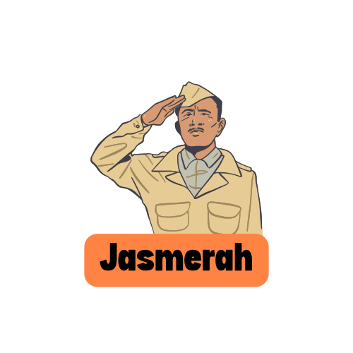

<p align="center">
    
</p>

<p align="center">
    
</p>

<p align="center">
    <font><i>JasMerah adalah sebuah platform atau website yang memperkenalkan Pahlawan-pahlawan dari Indonesia. Terdapat beberapa informasi tentang sejarah Indonesia. Dan juga sejarah pahlawan-pahlawan yang telah berjasa bagi Bangsa dan Negara!</i></font>
</p>

# JasMerah Here! 👋

Pernah ga sih kalian kepikiran tentang bangsa ini? bagaimana bangsa ini bisa bertahan? tentu saja Bangsa kita tidak berdiri semudah itu, banyak pengorbanan yang telah dilakukan untuk bangsa ini. Dengan pemikiran seperti itu, kami bangga telah membuat platform yang berusaha mengedukasi dan mengenal lagi pahlawan-pahlawan yang sangat berjasa bagi negara, rakyat, dan bangsa ini!

_"Bangsa yang besar adalah bangsa yang menghormati jasa pahlawannya.”_ – Bung Karno

## Authors

- [@AhmadUffi](https://www.github.com/ahmadUffi)
- [@Kuroi-RE](https://www.github.com/Kuroi-RE)

## Tech Stack

**React, TailwindCSS**

## Features

- Search
- Games
- Timeline
- Cross platform

## Run Locally

Clone the project

```bash
  git clone https://github.com/ahmadUffi/jasmerah.git
```

Go to the project directory

```bash
  cd my-project
```

Install dependencies

```bash
  npm install
```

Start the server

```bash
  npm run start
```

## Demo

https://jasmerah.vercel.app/

## Screenshots

### Beranda

<p>Halaman pertama ketika website di buka. Kami memberikan detail singkat tentang pahlawan, dan foto pahlawan</p>


### Timeline Sejarah Indonesia

<p>Ketika halaman discroll kebawah, kamu akan melihat Timeline Sejarah indonesia. Kamu dapat mengenang atau mengingat kembali bagaimana perjuangan pahlawan-pahlawan kita yang tersebar di penjuru indonesia.</p>


### List Pahlawan

<p>Ini adalah halaman list dari Pahlawan-pahlawan yang kami sediakan, kamu dapat melihat beberapa hal tentang pahlawan kita, kmu juga akan melihat biografi pahlawan dan pencapaian-pencapaiannya</p>


### Tentang Pahlawan

<p>Pada halaman ini kamu dapat melihat biografi pahlawan yang telah kamu pilih, melihat beberapa foto pahlawan, pencapaian yang telah diberikan dan kami menambahkan kata-kata motivasi dari pahlawan tersebut agar kita semakin semangat untuk menjaga Negara dan Bangsa kita</p>


### Games

<p>Setelah melihat semua sejarah pahlawan, kami ingin menguji pengetahuanmu soal Pahlawan Indonesia. Ini adalah halaman List games, disini ada beberapa game yang bertemakan Pahlawan untuk kamu mainkan. Selamat bermain :)</p>


## Lessons Learned

Dalam proyek kali ini kami belajar lebih dalam tentang pembuatan website menggunakan technologi React CSS, dalam proyek ini juga memperdalam skill yang kita miliki. Tentu dengan rasa bangga dapat menyelesaikan proyek untuk mengenang jasa para pahlawan.

## License

[MIT](https://choosealicense.com/licenses/mit/)
